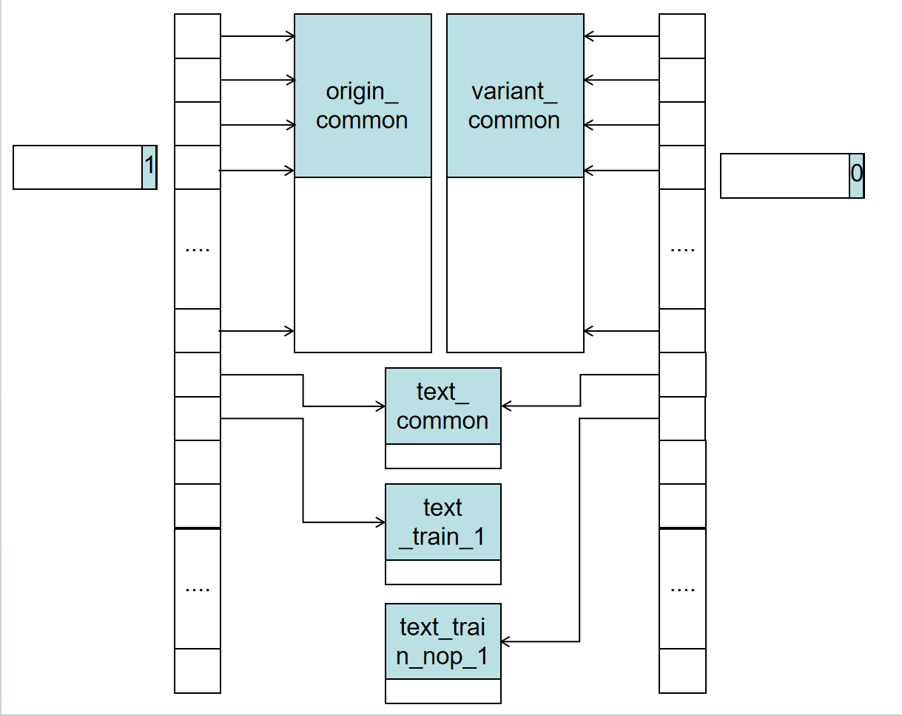

# 二进制内存切片和组装介绍

内存切割之后得到的二进制组装文件 bin_dist 如下
```
0x80000000 0x80040000
0x80000000 0x80020000 /home/zyy/divafuzz-workspace/build/fuzz_code/origin_common.bin /home/zyy/divafuzz-workspace/build/fuzz_code/variant_common.bin
0x80020000 0x80021000 /home/zyy/divafuzz-workspace/build/fuzz_code/text_common.bin
0x80021000 0x80022000 /home/zyy/divafuzz-workspace/build/fuzz_code/text_train_1.bin /home/zyy/divafuzz-workspace/build/fuzz_code/text_train_nop_1.bin
0x80022000 0x80023000 /home/zyy/divafuzz-workspace/build/fuzz_code/text_train_2.bin /home/zyy/divafuzz-workspace/build/fuzz_code/text_train_nop_2.bin
0x80023000 0x80024000 /home/zyy/divafuzz-workspace/build/fuzz_code/text_train_3.bin /home/zyy/divafuzz-workspace/build/fuzz_code/text_train_nop_3.bin
0x80024000 0x80040000 /home/zyy/divafuzz-workspace/build/fuzz_code/stack.bin
```

## part1: 地址范围

```
0x80000000 0x80040000
```

第一行是所有要拼接的内存总的内存范围，这里是 0x80000000 - 0x800400000 的 64 page

## part2: origin_common 和 variant_common

```
0x80000000 0x80020000 /home/zyy/divafuzz-workspace/build/fuzz_code/origin_common.bin /home/zyy/divafuzz-workspace/build/fuzz_code/variant_common.bin
```

`0x80000000 0x80020000`是该部分 binary 的地址范围，之后的文件`/home/zyy/divafuzz-workspace/build/fuzz_code/origin_common.bin /home/zyy/divafuzz-workspace/build/fuzz_code/variant_common.bin`则是该部分相关联 binary 文件。

init, secret, channel, mtrap, strap, data, random_data 等块被打包为 common 部分。origin_common 和 variant_common 的区别仅在于 secret 部分的密钥内容不同。common 部分的范围是 0x80000000 - 0x80020000 的 32 page，之所以没有用之前规定的 127 K，主要是为了凑一个整数。

origin_common.bin 为 DUT 的内存内容，variant_common.bin 为 VNT 的内存内容。因为这里的所有块都有 data 部分会被读甚至写，所以 DUT 和 VNT 不能共用同一分内存，而应该用两份。

## part3: text_common

```
0x80020000 0x80021000 /home/zyy/divafuzz-workspace/build/fuzz_code/text_common.bin
```

payload 部分的 main 函数的代码，包括 init、run_time、decode、exit 等块的代码部分。因为这部分的代码不会被修改，而且是 DUT 和 VNT 公用的，所以二者可以共用一份内存。这个 bin_dist 的地址范围是 0x80020000 - 0x80021000，文件是 text_common.bin。

## part4: text_train 和 text_train_nop

```
0x80021000 0x80022000 /home/zyy/divafuzz-workspace/build/fuzz_code/text_train_1.bin /home/zyy/divafuzz-workspace/build/fuzz_code/text_train_nop_1.bin
0x80022000 0x80023000 /home/zyy/divafuzz-workspace/build/fuzz_code/text_train_2.bin /home/zyy/divafuzz-workspace/build/fuzz_code/text_train_nop_2.bin
0x80023000 0x80024000 /home/zyy/divafuzz-workspace/build/fuzz_code/text_train_3.bin /home/zyy/divafuzz-workspace/build/fuzz_code/text_train_nop_3.bin
```

瞬态窗口链 transient-window-chain 的深度是多少，这里的行数就是多少。每个瞬态窗口部分由 load、delay、predict、transient、return 组成，为了方便切割和组装，他们被单独作为一个 section，并且被页对齐，这样就可以按页调度了。

开始的数据是这个部分的起始地址和结束地址，之后的 text_train_*.bin 是原始的 section，text_train_nop_*.bin 是 transient 部分被替换为 nop 之后的 section。DUT 和 VNT 共用这部分的 text_train_*.bin 和 text_train_nop_*.bin，并根据对 csr 或者 mmio 的修改做切换。

## part5: stack

```
0x80024000 0x80040000 /home/zyy/divafuzz-workspace/build/fuzz_code/stack.bin
```

stack section 部分，这部分其实不需要做数据的载入和初始化，但是为了可以描述完所有的 memory part，所以特地加了这部分作为结尾。stack.bin 内其实没有内容，只是为了填补空格才特意加进来的，就不需要特别判断要不要初始化了。

## 内存的数据结构

我们可以设计如下的数据结构来方便内存切换和内存访问：



因为我们的内存范围是 80000000 - 80040000，一共 64 页，所以我们可以为 DUT 和 VNT 分别构建一个 64 位的指针数组，每个指针指向对应的页，且一开始初始化为 0。之后我们开始内存初始化。

例如第一部分的内存范围是 80000000 - 80020000，所以可以分配两个大小为 20000 的内存，然后将数组的 0-1F 的表项指向内存对应的页，然后读取 origin_common.bin 和 variant_common 分别写入对应的内存即可。如果是 text_common 则可以 DUT 和 VNT 共用一个内存。

而如果是 text_train_* 和 text_train_nop_*，则我们维护一个被 mmio 的变量（DUT 和 VNT 不共用），这个变量的低 12 位分别对应了一组 transient windows 指令的切换。如果变量的第 0 位被设置为 0，则对应的表项指向 text_train_* 的 text 块，如果被设置为 1， 则指向 text_train_nop_* 的 text 块。

当内存访问的时候根据地址找到对应的页号，然后根据数组的指针找到对应的内存块，然后根据地址的页内偏移找到对应的数据即可。

## 节约内存

这里各个部分瓜分了所有的 128 K 内存空间，但是其实很多内存我们是不使用的，这个时候其实可以不分配或者初始化这部分内存。例如 stack 部分的内存只有一页会被合法使用，common 部分的 58 页都不会被合法访问，所以其实可以不分配内存。

不过因为一共也才 128 K，所以节约与否问题不大。如果有进分配使用的内存的考虑，则我这里 bin_dist 记录内存范围的时候需要根据 bin 的真实大小进行记录。
