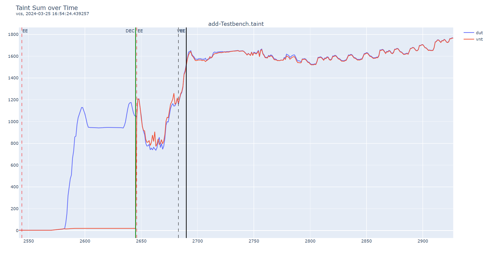
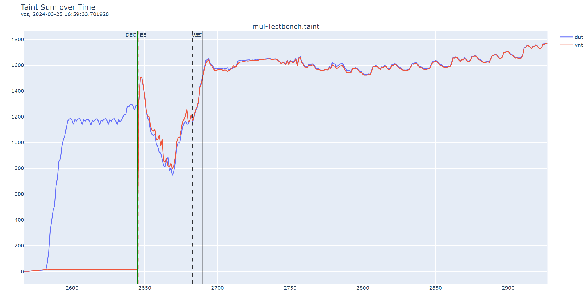
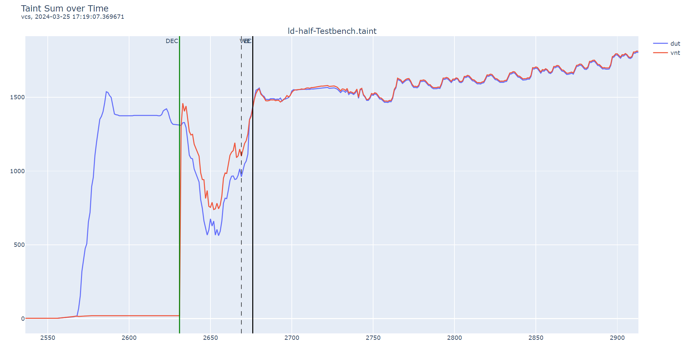
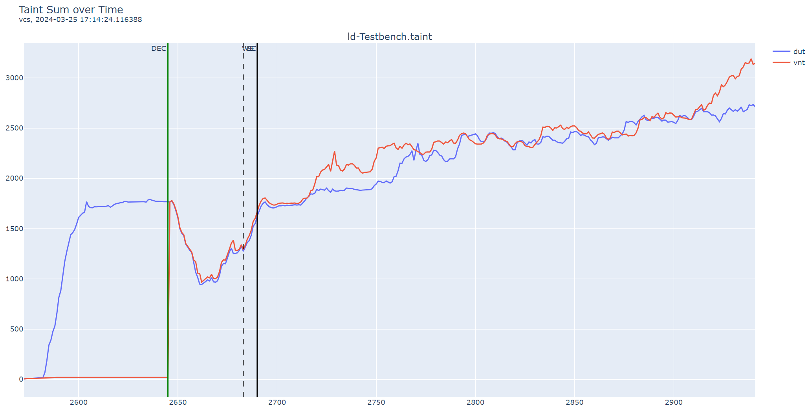
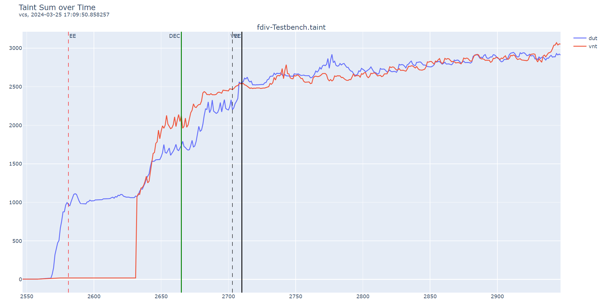
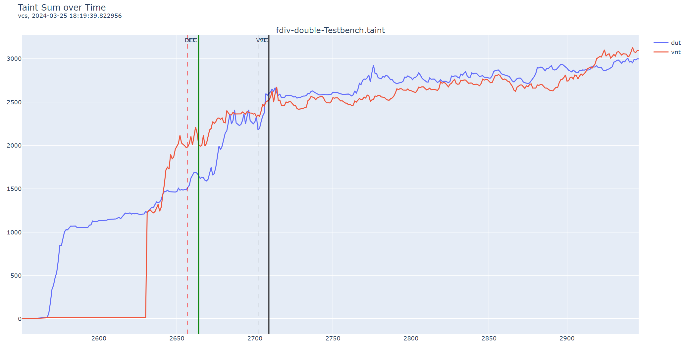

# fuzz code 的 block 设计

## block 流程图
```
    +---------------+                      +---------------+ 
    |               |       +------------->|               |    
    |     init      |       |              |     delay     | 
    |               |       |              |               | 
    +---------------+       |              +---------------+     
            ||              |                      ||                                
            ||              |                      ||                                
            \/              |                      \/                                
    +---------------+       |              +---------------+                         
    |               |-------+              |               |                         
    |     train     |                      |    predict    |-------+                 
    |               |<----------+          |               |       |                 
    +---------------+           |          +---------------+       |                 
            ||                  |                  ||              |                 
            ||                  |                  ||              |                 
            \/                  |                  \/              |                 
    +---------------+           |          +---------------+       |                 
    |               |           |          |               |       |                 
    |     poc       |           |          |     victim    |       |                 
    |               |           |          |               |       |                 
    +---------------+           |          +---------------+       |                    
            ||                  |                  ||              |                 
            ||                  |                  ||              |                 
            \/                  |                  \/              |                 
    +---------------+           |          +---------------+       |                 
    |               |           |          |               |       |                 
    |     exit      |           +----------|     return    |<------+                
    |               |                      |               |                 
    +---------------+                      +---------------+                         
```

## init
* 作用：用来做寄存器的初始化，设置页表、handle、运行模式，进入 _init 开始正式 fuzz
* 实现：rvsnap + InstGenerator/InitManager.S + reg_init.hjson

## delay
* 作用：对 predict 块的数据流进行延迟，迫使 predict 块进行猜测执行
* 实现：对某些寄存器做随机立即数初始化，随机生成一些指令做数据流计算
* 约束：有大量的 RAW 数据依赖，且尽量复用寄存器

## predict
* 作用：被 delay 块延迟执行，被迫进入猜测执行，产生瞬态窗口
* 实现：branch、call、return、except、store+load 中的一种
* 约束：涉及的 RS 是 delay 得到的 RD

## victim
* 作用：执行瞬态窗口的时候执行的代码，用来泄露 secret
* 实现：任意代码随机执行？
* 约束：第一条指令必须 trapline[param2] 访问指定 secret 地址的内存

## return
* 作用：跳转预测的 predict 触发瞬态窗口时，回滚之后会进入的块；victim 直接退出到的块
* 实现：恢复 train 返回的 ra 地址，return 返回 train 块
* 其他：可以考虑在 delay 前加一些操作，比如保存 ra 的值到堆栈，然后直接回复 ra 的值

## train
* 作用：训练 predict 使得猜测执行的时候跳入瞬态窗口执行 vicitim
* 实现：简单的 for 循环，提供一个 {param1,param2} 数组；param1 影响 predict 的控制流，param2 影响 victim 的数据流。前 N 组 {param1,param2} 是跳入 victim，不访问 secret 的；最后一组 {param1,param2} 是跳入 return，但是进入 victim 的时候是访问 secret 的
* param1 的计算：predict 的指令事先生成，然后约束 param1 分别满足进入 victim 和 return
* param2 的计算：victim 的指令事先生成，然后约束 param2 分别访问 secret 和不访问 secret

## poc
* 作用：进一步泄露 taint
* 实现：PocManager + access_time()

## exit
* 作用：停机
* 实现：exit() 写特殊寄存器

## 寄存器分工
* sp：堆栈寄存器，不可以随机使用
* gp：数据段寄存器，用于访问随即指令和 train 的 param 需要的立即数
* tp：堆栈寄存器，不可以随机使用
* a0：param1 的传参，不可以随机使用
* a1：param2 的传参，不可以随机使用
* ra：返回地址，除了 return 的猜测执行不可以随即使用

## 控制变量
对于 delay、predict、victim 都有已有的样例，可以考虑每次之随机生成三个模块中的其中一个，其他的用固定样例，然后只针对这个 block 进行 fuzz

## train param for train block
没有启用 bim，默认 not taken
branch_taken 情况下，默认 not taken，不训练就可以触发成功
启用bim，默认 taken
branch_taken 情况下，初始化为 10，train 1 次可以成功触发 1 次，train 2 次可以成功触发 2 次

没有启用 bim，默认 not taken
branch_not_taken 情况下，默认 not taken，train 3 次可以成功触发 1 次，train 4 次可以成功触发 2 次
启用 bim，默认 taken
branch_not_taken 情况下，初始化为 10，默认 taken，不 train 就可以触发 1 次，train 1 次以上可以触发 2 次

## delay param for delay block
| transient window | kind  | instruction sequence                           |
|------------------|-------|------------------------------------------------|
| 8                | 1 F/D | fcvt                                           |
| 14               | 2 F/D | fnmadd fcvt                                    |
| 14               | 2 F/D | fmadd  fcvt                                    |
| 15               | 2 F/D | fcvt   fcvt                                    |
| 22               | 2 F/D | fsub   fcvt                                    |
| 17               | 3 F/D | fsgnjn fmadd  fcvt                             |
| 20               | 3 F/D | fmadd  fmadd  fcvt                             |
| 21               | 3 F/D | fnmadd fsgnjx fcvt                             |
| 21               | 3 F/D | fnmadd fcvt   fcvt                             |
| 24               | 4 F/D | fsgnjx fmin   fmadd  fcvt                      |
| 21               | 5 F/D | fsgnjx fsqrt  fsqrt  fsqrt  fcvt               |
| 24               | 5 F/D | fadd   fmax   fdiv   fmax   fcvt               |
| 24               | 7 F/D | fdiv   fdiv   fdiv   fidv   fidv   fdiv   fcvt |

* 1 条浮点的瞬态窗口为 8
* 2 条浮点的瞬态窗口为 14-22
* 3 条以上浮点的瞬态窗口为 17-24
* 瞬态窗口大小不超过 24

结论：浮点指令数目以 3-5 为宜，瞬态窗口基本在 20-24 之间

| transient window | kind      | instruction sequence                           |
|------------------|-----------|------------------------------------------------|
| 3                | 3 I       | and    and    and                              |
| 10               | 2 I + 1 M | srlw   mulhsu addiw                            |
| 12               | 2 I + 1 M | mulhsu add    divu                             |
| 14               | 2 I + 1 M | sub    divw   add                              |
| 20               | 1 I + 2 M | mulu   remu   sltu                             |
| 21               | 2 I + 1 I | div    srli   sub                              |
| 24               | 1 I + 2 M | divw   addiw  div                              |
| 12               | 3 I + 1 M | mulw   sll    slliw   srli                     |
| 13               | 3 I + 1 M | srai   rem    xor     slti                     |

* 任意指令都可以打开大小为 3 的瞬态窗口，这是 branch 预测错误本身的代价
* 3 条整型指令不会带来任何额外的收益
* 1 条 M 指令配合 2 条 I 指令的瞬态窗口 10-12
* 2 条 M 指令配合 1 条 I 指令的瞬态窗口 20-24
* 只有 M 指令可以带来瞬态窗口收益
* 瞬态窗口最大不超过 24
* div/rem 的收益略大于 mul，但是也和操作数大小有关
* 只有靠近 predict 指令的最近的指令序列才有效

结论：M 型指令和 F 型指令混合使用，指令序列长度 3-5 为宜，可以打开瞬态窗口大小 18-24 

## rewind 阻塞类型
1. 使用 add 等算术指令和 mul、div 等 M 扩展的指令，这些指令都是单周期的，所以在瞬态窗口回滚的时候，rob 和 fetch-buffer 都会被直接撤销，因此当瞬态窗口撤销后它基本不会对微体系状态造成影响，无法做到数据的侧信道泄露。在 taint 波形图中可以看到，因为在瞬态窗口内部 origin 和 variant 因为控制流的不同导致 taint 产生了巨大的分歧，但是当瞬态窗口结束回滚之后，variant 的 taint 急速上升和 origin 的 taint 保持一致，最后二者轨迹基本重合，故而在瞬态窗口结束之后二者的微体系状态并不明显差异，无法通过测信道泄露机密。





2. 在 if 块内部使用 load/store 指令进行填充，当瞬态窗口回滚的时候，因为 load/store 已经在 LSU 中执行，并且向 cache、总线等部件发出请求等待响应等，因此必须要等待他的执行事务完整结束才可以回滚该指令。如果 load/store 的条数过少，这些指令的事务虽然会影响回滚地进行，但是影响十分有限，一段时间之后二者的状态就会趋于一致，导致无法利用微体系内容进行攻击。



但是如果 load/store 指令的条数较多，比如 10-20 条，因为瞬态窗口无法直接回滚，fetch-buffer 也会被阻塞，在回滚之后需要重新访问内存载入正确的指令，进而导致 origin 的执行会显著慢于 variant。之后二者的执行状态产生分歧和不一致，可以以此反应 secret 信息。



3. fdiv 则利用了 FPU 指令作为协处理器，当接收到指令之后必须等待指令执行完毕，无法直接撤销执行的能力来阻止 rob 和 fetch-buffer 的回滚，进而造成 origin 和 variant 的差异。相比于 load/store，fdiv 指令可以用更少的条数就触发瞬态攻击。



如果引入更多的 fdiv 指令可以产生更大的差异，从而有更明显的攻击能力。



结论：
* 算术指令、M 扩展指令都不会导致窗口回滚阻塞，LSU、FPU、rocc 这种多周期、外部单元托管的指令才会
* 指令数量越多对窗口延迟的影响越大，越能导致后续状态的发散
* 发散程度是有上限的

## predict 设计
victim

当且仅当第一次 + victim
load -- no train
predict_block_entry:
    addi a0, a0, t2
    sd zero, 0(a0)

当且仅当第一次 + victim
except -- no train
predict_block_entry:
    pass

当且仅当第一次 + train
except -- no train
predict_block_entry:
    ld t0, 0(zero)

第一次和之后的所有都可以
branch -- 3 train and can 2 trigger
predict_block_entry:
    addi t2, t2, imm
predict_block_transient_entry:
    bne t2, a0, label

call -- 1 train and can 1 trigger
predict_block_entry:
    add a0, t2, a0
predict_block_transient_entry:
    jalr ra, imm(a0)

当且仅当第一次
return -- 1 train and can 1 trigger
    add a0, t2, a0
    jalr zero, imm(a0)
predict_block_entry:
    call load_init_block_entry

第二次之后
predict_block_entry:
    add a0, t2, a0
    jalr zero, imm(a0)
predict_block_transient_entry:
    auipc t0, 0
    add ra, t0, x0
    jalr x0, 12(ra)
    jalr x0, 16(ra)
    jalr ra, 16(t0)

## 表格

| predict_place | load | except | branch | call | return |
|:-------------:|:----:|:------:|:------:|:----:|:------:|
| boot-train    |  no  |  yes   | swap   | swap | yes    |
| boot-victim   |  yes |  yes   | yes    | yes  | yes    |
| chain-train   |  no  |  no    | yes    | yes  | yes    |
| chain-victim  |  no  |  no    | yes    | yes  | yes    |

| predict_kind  | boot-train | boot-victim | chain-train | chain-victim |
|:-------------:|:----------:|:-----------:|:-----------:|:------------:|
| load          |      0     |       1     |      no     |      no      |
| except        |      0     |       1     |      no     |      no      |
| branch        |      2     |       1     |      1      |      1       |
| call          |      1     |       1     |      0      |      1       |
| return        |      0     |       1     |      0      |      1       |

## trigger 设计

### load, store

category: LOAD STORE FLOAT_LOAD FLOAT_STORE
connect: a0 <- dep + a0
constraint: rs1 <- a0
parameter: a0 + dep == secret_page_base/random_data_block_page_base

### AMO

category: AMO
connect: a0 <- dep + a0
constraint: rs1 <- a0
parameter: a0 + dep == secret_page_base/random_data_block_page_base + [-0x800, 0x7ff]

### load_sp, store_sp

category: LOAD_SP STORE_SP
connect: sp <- dep + a0
constraint: null
parameter: a0 + dep == secret_page_base/random_data_block_page_base

### v4

connect: a0 <- dep + a0
constraint: sd zero, 0(a0)
parameter: dep + a0 == access_secret_block_target_offset

### bim

category: BRANCH
inst: beq, bne, blt, bge, bltu, bgeu, c.beqz, c.bnez
connect: a0 <- dep + a0
constraint: rs1 <- a0, rs2 <- dep, label == ret_label/not_return_label
parameter: satisfied

### btb

category: JUMP
inst: jalr, c.jalr, c.jr
connect: a0 <- dep + a0
constraint: rs1 <- a0
parameter: a0 + imm +dep == ret_label/not_return_label

### rsb

category: JUMP
inst: jalr, c.jalr, c.jr
connect: ra <- dep + a0
constraint: rs1 <- ra, rd <- zero
parameter: ra + imm == ret_label/not_return_label

### other

category: ARITHMETIC
constraint: rs1 <- dep

category: FLOAT
constraint: frs1 <- dep


